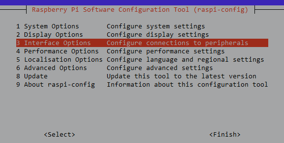
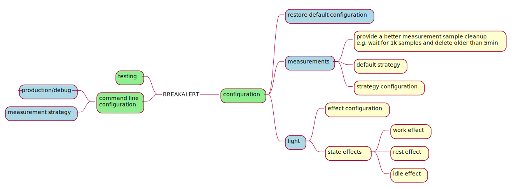

# breakalert project

## Raspberry Pi Zero Setup

### Setting up wireless networking

Source: <https://www.raspberrypi.org/documentation/configuration/wireless/headless.md>  
Put this file onto the boot partition of the SD card `wpa_supplicant.conf`.   
:warning: **5G wireless does not work!**

```properties
ctrl_interface=DIR=/var/run/wpa_supplicant GROUP=netdev
update_config=1
country=IE

network={
 ssid="<Name of your wireless LAN>"
 psk="<Password for your wireless LAN>"
}
```

### Enable SSH on a headless Raspberry Pi (add file to SD card on another machine)

Source: <https://www.raspberrypi.org/documentation/remote-access/ssh/README.md>
For headless setup, SSH can be enabled by placing a file named `ssh`, without any extension, onto the boot partition of the SD card from another computer. The content of the file does not matter; it could contain text, or nothing at all.

### Password-less SSH access

`ssh-copy-id -i ~/.ssh/id_rsa.pub pi@192.168.1.10`

### Configure I2C

Type `sudo raspi-config`  

Choose interface  
  
Enable i2c  
  

### TMUX

- [tmux cheatsheet](./docs/img/tmux.png)
- [tmux cheatsheet b/w](./docs/img/tmux-printer.png)

## Software

### How to install dependencies

Look at the [Makefile](./Makefile) file.

### Run app

```bat
REM Set PYTHONPATH
set PYTHONPATH=.
REM Run app using python from ven
.\venv\Scripts\python.exe states/main.py
```

### Run unit tests

Run command from the root directory:

```shell
  pytest
```

### Get coverage report

Activate venv and run the following commands:

```shell
    (venv) C:\git\python\breakalert>coverage run -m pytest
    (venv) C:\git\python\breakalert>coverage html
```

## TODO

- [ ] Update/restore get_distance method by adding while loop and not returning None(s)
- [ ] Remove color enum
- [ ] Fix IP address light brightness
- [ ] Add workflow to generate plantuml files



## Components


## Configuration


## Cancelable repetitive task

| Note                       | Link                                                                                                             |
| -------------------------- | ---------------------------------------------------------------------------------------------------------------- |
| Cancelable repetitive task | <https://stackoverflow.com/questions/22498038/improve-current-implementation-of-a-setinterval/22498708#22498708> |
| metronome like ticks       | <https://stackoverflow.com/a/25251804/4279>                                                                      |
